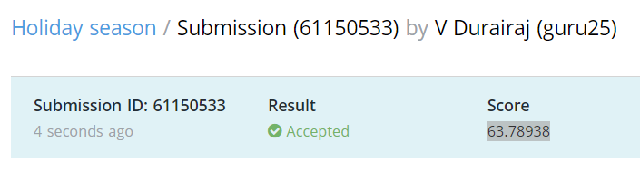

[TOC]

# Problem

- https://www.hackerearth.com/challenges/competitive/hackerearth-deep-learning-challenge-holidays/problems/

    - https://www.hackerearth.com/problem/machine-learning/holiday-season-11-2c924626

## CNNs in General

- [Building CNN Model with 95% Accuracy | Convolutional Neural Networks (analyticsvidhya.com)](https://www.analyticsvidhya.com/blog/2021/01/building-a-cnn-model-with-95-accuracy/)
- [Image Classification Model | CNN For Image Classification (analyticsvidhya.com)](https://www.analyticsvidhya.com/blog/2020/07/how-to-train-an-image-classification-model-in-pytorch-and-tensorflow/)

- [CNN Image Classification | Image Classification Using CNN (analyticsvidhya.com)](https://www.analyticsvidhya.com/blog/2020/02/learn-image-classification-cnn-convolutional-neural-networks-3-datasets/)
- [How Do Convolutional Layers Work in Deep Learning Neural Networks? (machinelearningmastery.com)](https://machinelearningmastery.com/convolutional-layers-for-deep-learning-neural-networks/)
- 

## Kaggle

- https://www.kaggle.com/khanrahim/hackereath-holiday-season-deep-learning-contest

### Reference Kaggle

- [Region,Edge and clustering Based Segmentation | Kaggle](https://www.kaggle.com/accountstatus/region-edge-and-clustering-based-segmentation)
- [Image Classification ResNet 91.5 accuracy | Kaggle](https://www.kaggle.com/shrijeethsuresh/image-classification-resnet-91-5-accuracy)
- [Xception + ResNet | Learn How to Stack | Kaggle](https://www.kaggle.com/kabirnagpal/xception-resnet-learn-how-to-stack#Plotting-some-images)
- [CNN Architectures : VGG, ResNet, Inception + TL | Kaggle](https://www.kaggle.com/shivamb/cnn-architectures-vgg-resnet-inception-tl#PreTrained-Model-:-VGG16)
- 

## Inception

### Theory

- [Inception Network | Implementation Of GoogleNet In Keras (analyticsvidhya.com)](https://www.analyticsvidhya.com/blog/2018/10/understanding-inception-network-from-scratch/)

- [CNN Architecture: A Brief Introduction to Inception Network | by Vishal Mishra | The Startup | Medium](https://medium.com/swlh/cnn-architecture-a-brief-introduction-to-inception-network-c94396157fba)

- [A Simple Guide to the Versions of the Inception Network | by Bharath Raj | Towards Data Science](https://towardsdatascience.com/a-simple-guide-to-the-versions-of-the-inception-network-7fc52b863202)

- [Review: Batch Normalization (Inception-v2 / BN-Inception) —The 2nd to Surpass Human-Level Performance in ILSVRC 2015 (Image Classification) | by Sik-Ho Tsang | Medium](https://sh-tsang.medium.com/review-batch-normalization-inception-v2-bn-inception-the-2nd-to-surpass-human-level-18e2d0f56651)

- [Review: NIN — Network In Network (Image Classification) | by Sik-Ho Tsang | Towards Data Science](https://towardsdatascience.com/review-nin-network-in-network-image-classification-69e271e499ee)
- [Illustrated: 10 CNN Architectures | by Raimi Karim | Towards Data Science](https://towardsdatascience.com/illustrated-10-cnn-architectures-95d78ace614d#bca5)
- [Image Classification using CNN in PyTorch | by Manish Kumar | Analytics Vidhya | Medium](https://medium.com/analytics-vidhya/image-classification-using-cnn-in-pytorch-65b1968d9e1f)
- 

### Code

#### Tensorflow

- [models/inception_v1.py at 9ff763923a2f0795c93c09a843f1ed5da4d556aa · tensorflow/models (github.com)](https://github.com/tensorflow/models/blob/9ff763923a2f0795c93c09a843f1ed5da4d556aa/research/slim/nets/inception_v1.py#L31)

- [pretrained-models.pytorch/inceptionresnetv2.py at 8aae3d8f1135b6b13fed79c1d431e3449fdbf6e0 · Cadene/pretrained-models.pytorch (github.com)](https://github.com/Cadene/pretrained-models.pytorch/blob/8aae3d8f1135b6b13fed79c1d431e3449fdbf6e0/pretrainedmodels/models/inceptionresnetv2.py#L234)
- 

#### keras

- [deep-learning-models/inception_v3.py at master · fchollet/deep-learning-models (github.com)](https://github.com/fchollet/deep-learning-models/blob/master/inception_v3.py)
- 

#### Pytorch

- [Inception-v3-with-pytorch/InceptionV3FromScratch.ipynb at master · vatsmanish/Inception-v3-with-pytorch (github.com)](https://github.com/vatsmanish/Inception-v3-with-pytorch/blob/master/InceptionV3FromScratch.ipynb)
- [vision/torchvision/models at master · pytorch/vision (github.com)
- [VGG PyTorch Implementation - Jake Tae](https://jaketae.github.io/study/pytorch-vgg/)
- [[InceptionNet in PyTorch - Jake Tae](https://jaketae.github.io/study/pytorch-inception/)](https://github.com/pytorch/vision/tree/master/torchvision/models)
- [Image Classification using CNN in PyTorch | by Manish Kumar | Analytics Vidhya | Medium](https://medium.com/analytics-vidhya/image-classification-using-cnn-in-pytorch-65b1968d9e1f)

## Inception v-3

### Training

```python
[Epoch 99]
Training :  |██████████████████████████████████████████████████| 100.0% Complete
train-acc : 98.1450% train-loss : 0.05967
elapsed time: 21s
```

# Normal Model

| Model       | Test Accuracy |
| ----------- | ------------- |
| Resnet - 18 | 53.15147      |
| Resnet - 34 | 26.82481      |
| Resnet - 50 | 53.47971      |
| Inceptionv-1| 58.39013      |
| Inceptionv-3| 63.78938      |




[my submission](https://www.hackerearth.com/submission/61150533/)


# References:

- https://www.christopherlovell.co.uk/blog/2016/04/27/h5py-intro.html
- https://scikit-image.org/docs/stable/auto_examples/transform/plot_rescale.html
- https://docs.h5py.org/en/latest/strings.html


