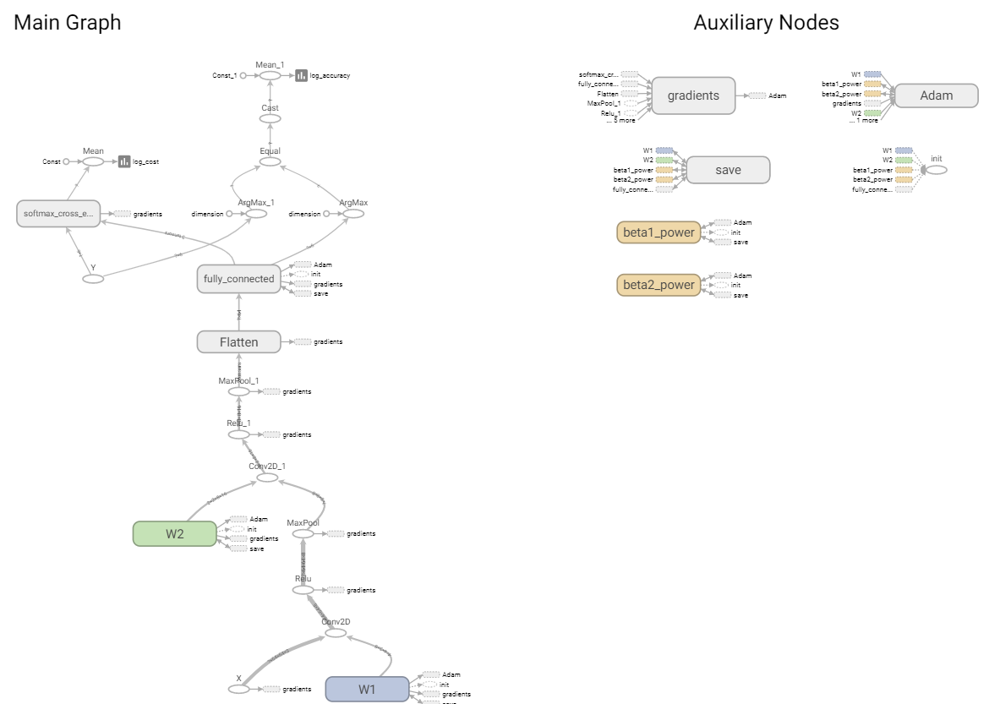
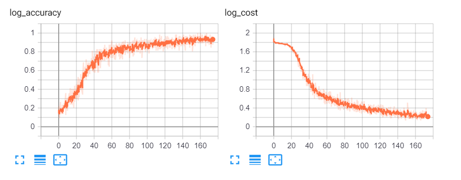

## Installation

- run this command to install all the neccesary libraries to run

```bash
pip3 install -r requirements.txt
```

## Training

- to run the model try this command

```bash
python3 init.py
```

with these hyper-parameters

- `learning_rate` = 0.001
- `num_epochs` = 175
- `minibatch_size` = 64

```python
Cost after epoch 0: 1.971088 , Accuracy : 0.125000
Cost after epoch 5: 1.894490 , Accuracy : 0.214286
Cost after epoch 10: 1.881987 , Accuracy : 0.267857
Cost after epoch 15: 1.854971 , Accuracy : 0.267857
Cost after epoch 20: 1.783818 , Accuracy : 0.446429
Cost after epoch 25: 1.621449 , Accuracy : 0.464286
Cost after epoch 30: 1.383123 , Accuracy : 0.589286
Cost after epoch 35: 1.152604 , Accuracy : 0.642857

...

Cost after epoch 105: 0.395490 , Accuracy : 0.857143
Cost after epoch 110: 0.384557 , Accuracy : 0.946429
Cost after epoch 115: 0.364339 , Accuracy : 0.946429
Cost after epoch 120: 0.369470 , Accuracy : 0.839286
Cost after epoch 125: 0.349281 , Accuracy : 0.928571
Cost after epoch 130: 0.338422 , Accuracy : 0.875000
Cost after epoch 135: 0.324456 , Accuracy : 0.964286
Cost after epoch 140: 0.315803 , Accuracy : 0.946429
Cost after epoch 145: 0.290569 , Accuracy : 0.875000
Cost after epoch 150: 0.287585 , Accuracy : 0.875000
Cost after epoch 155: 0.275523 , Accuracy : 0.928571
Cost after epoch 160: 0.265517 , Accuracy : 1.000000
Cost after epoch 165: 0.248896 , Accuracy : 0.910714
Cost after epoch 170: 0.262932 , Accuracy : 0.892857
Train Accuracy : 92 %
Test Accuracy : 85 %
```

### Tensorboard

try running this command on your shell and check the model logs (Accuracy,Logs)

```bash
tensorboard --logdir=runs --host localhost --port 8088
```

- Model Architecture



- logs



### Restore

- restore the model the using the `restore.py` file in this directory , try to do your prediction on the desired image to test the model

# Reference

[python - How to restore a place holder in tensorflow? - Stack Overflow](https://stackoverflow.com/questions/47977239/how-to-restore-a-place-holder-in-tensorflow)

[python - TensorFlow save and restore the trained well CNN model was not working - Stack Overflow](https://stackoverflow.com/questions/52984932/tensorflow-save-and-restore-the-trained-well-cnn-model-was-not-working)

[python - Getting list of pixel values from PIL - Stack Overflow](https://stackoverflow.com/questions/1109422/getting-list-of-pixel-values-from-pil)
