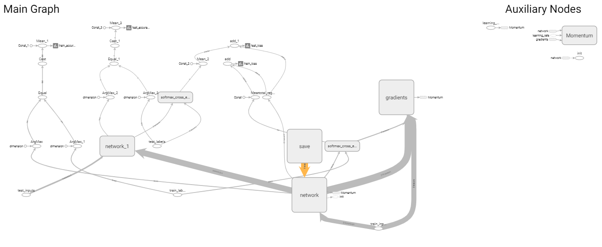

## Installation

- run this command to install all the neccesary libraries to run

```bash
pip3 install -r requirements.txt
```

## Training

```bash
python3 init.py
```

# Implementation

- [Resnet in Tensorflow](https://github.com/taki0112/ResNet-Tensorflow/blob/f395de3a53ddd8bb53828c79bd3c17e77d59858d/ResNet.py) 


### Tensorboard

try running this command on your shell and check the model logs (Accuracy,Logs)

```bash
tensorboard --logdir=runs --host localhost --port 8088
```

- Model Architecture



# Future Improvements

https://medium.com/@SeoJaeDuk/wide-residual-networks-with-interactive-code-5e190f8f25ec

https://github.com/szagoruyko/wide-residual-networks?utm_source=catalyzex.com

https://stackoverflow.com/questions/44873273/what-do-the-options-in-configproto-like-allow-soft-placement-and-log-device-plac
